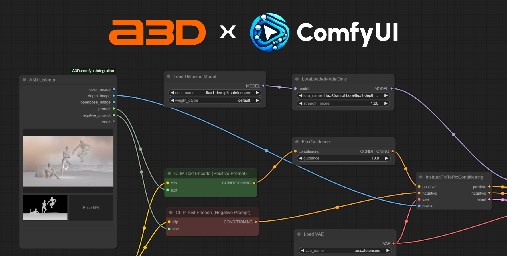

# A3D ComfyUI Integration

## About
A3D is a AI x 3D hybrid tool that allows you to compose 3D scenes and render them with AI. This integration allows you to send the color & depth images to ComfyUI. You can use it as a pose controller, or scene composer for your ComfyUI workflows.

## Installation

1. Open ComfyUI Manager
1. Install via Git URL -> add `https://github.com/n0neye/A3D-comfyui-integration`
    - If you see `This action is not allowed with this security level configuration` error, you can change the security level from `normal` to `weak` in the `ComfyUI\user\default\ComfyUI-Manager\config.ini` file.
1. Restart ComfyUI

## Usage 
1. Add `A3D Listener` to your existing workflow, or open the [example workflow](https://github.com/n0neye/A3D-comfyui-integration/blob/main/example_workflows/A3D_flux_depth_lora_example.json)
1. In the Render section of A3D, click `Send to ComfyUI`, this will send the color & depth images to ComfyUI

## TODO
- [ ] Add OpenPose support
- [ ] Add animation and video support
